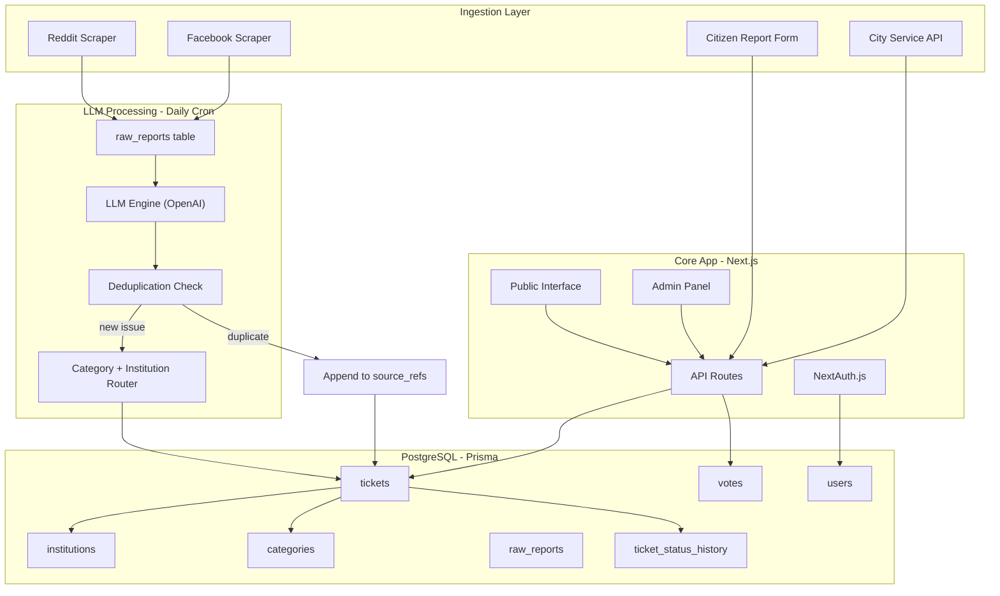
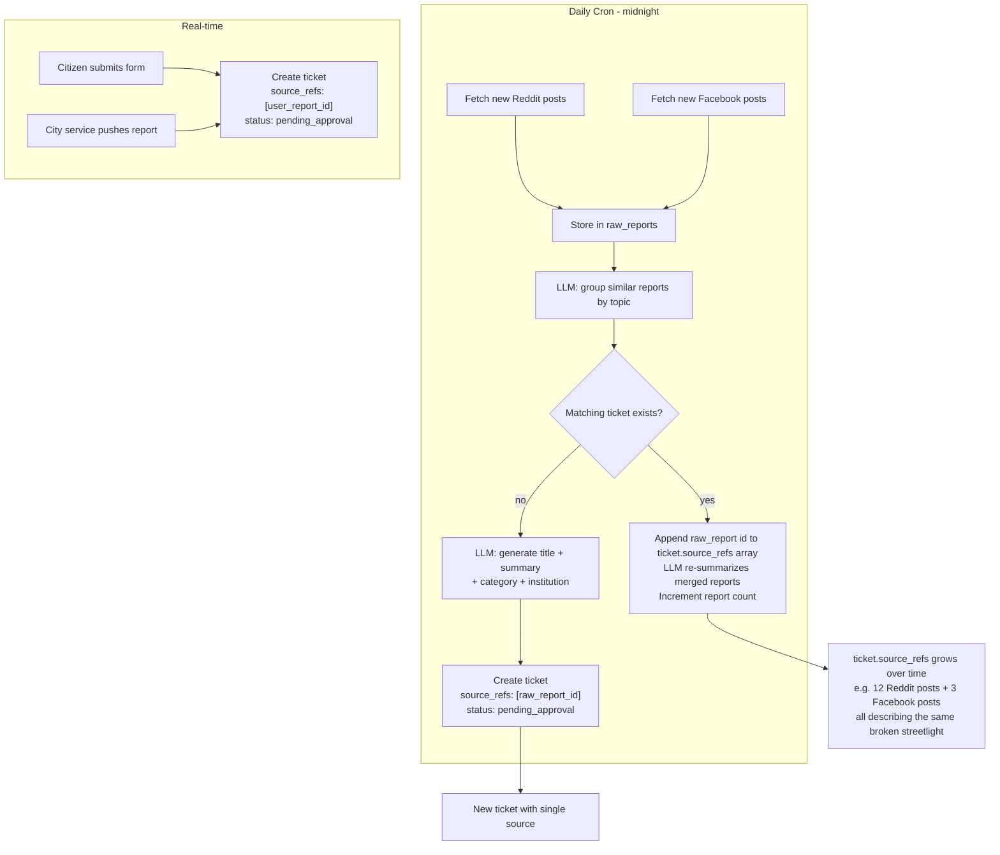

# City Issue Planner — System Architecture

## System Architecture

```mermaid
flowchart TD
    subgraph ingestion [Ingestion Layer]
        Reddit[Reddit Scraper]
        Facebook[Facebook Scraper]
        UserReport[Citizen Report Form]
        CityService[City Service API]
    end

    subgraph processing [LLM Processing - Daily Cron]
        RawStore[raw_reports table]
        LLM["LLM Engine (OpenAI)"]
        Dedup[Deduplication Check]
        Classifier[Category + Institution Router]
    end

    subgraph core [Core App - Next.js]
        PublicUI[Public Interface]
        AdminUI[Admin Panel]
        API[API Routes]
        Auth[NextAuth.js]
    end

    subgraph db [PostgreSQL - Prisma]
        Tickets[tickets]
        Users[users]
        Votes[votes]
        Institutions[institutions]
        Categories[categories]
        RawReports[raw_reports]
        StatusHistory[ticket_status_history]
    end

    Reddit --> RawStore
    Facebook --> RawStore
    UserReport --> API
    CityService --> API

    RawStore --> LLM
    LLM --> Dedup
    Dedup -->|"new issue"| Classifier
    Dedup -->|"duplicate"| AppendRefs["Append to source_refs"]
    Classifier --> Tickets
    AppendRefs --> Tickets

    API --> Tickets
    API --> Votes
    PublicUI --> API
    AdminUI --> API
    Auth --> Users
    Tickets --> Institutions
    Tickets --> Categories
    Tickets --> StatusHistory
```

## Ingestion Flows

```mermaid
flowchart TD
    subgraph daily [Daily Cron - midnight]
        A[Fetch new Reddit posts] --> B[Store in raw_reports]
        C[Fetch new Facebook posts] --> B
        B --> D["LLM: group similar reports by topic"]
        D --> E{Matching ticket exists?}
        E -->|yes| F["Append raw_report id to ticket.source_refs array\nLLM re-summarizes merged reports\nIncrement report count"]
        E -->|no| G["LLM: generate title + summary\n+ category + institution"]
        G --> H["Create ticket\nsource_refs: [raw_report_id]\nstatus: pending_approval"]
    end

    subgraph realtime [Real-time]
        I[Citizen submits form] --> J["Create ticket\nsource_refs: [user_report_id]\nstatus: pending_approval"]
        K[City service pushes report] --> J
    end

    F --> MergedTicket["ticket.source_refs grows over time\ne.g. 12 Reddit posts + 3 Facebook posts\nall describing the same broken streetlight"]
    H --> NewTicket[New ticket with single source]
```
